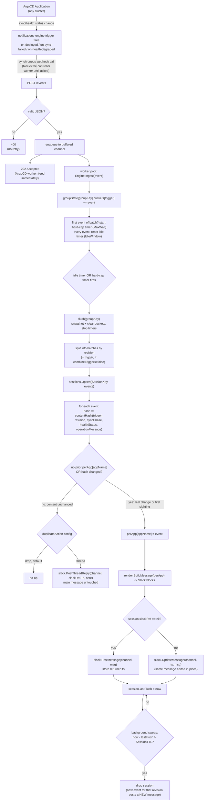

# argocd-notifier

ArgoCD notification aggregation service.

## Problem

ArgoCD's notifications-engine fires one message per `Application`. When an ApplicationSet fans a single service out across many clusters (e.g. one service targeting N clusters, all sharing a label like `application/name: sample`), a single fleet-wide deploy or incident produces one Slack message per cluster instead of one per rollout.

argocd-notifier sits between ArgoCD's notifications-engine and Slack: it receives one webhook call per Application event, groups events sharing a label, and keeps **one live Slack message per rollout**, editing it in place as more events arrive, instead of posting a new message every time.

## Design decisions

- **Grouping key is configurable** — a label name (i.e. `application/name`), not hardcoded, since this is meant to be reused by other ArgoCD users with their own label scheme.
- **Debounce, not just batching**: an idle-reset timer (extends on each new event) plus an independent hard max-wait cap that never extends. Both configurable. This paces how often Slack gets hit — it does not define how long a rollout's message stays live.
- **Sessions**: a Slack message represents one *session*, keyed by `(groupKey, revision)` by default, or `(groupKey, revision, trigger)` when `combineTriggers=false`. Every flush for an existing session calls `chat.update` on the same message timestamp instead of posting a new one; the message always reflects each app's latest known status (last-write-wins per app name), not just the most recent flush's delta. A session expires after `sessionTTL` of inactivity — a later event for the same revision then starts a fresh message rather than editing one that's scrolled out of view.
- **No standalone dedup cache**: ArgoCD's webhook delivery is at-least-once with no send-id, so a retry can't be structurally distinguished from a genuine recurrence of identical status — both hash the same. Retries landing in the *same* debounce window are already harmless (last-write-wins merge, one render/post per flush). For a retry or recurrence landing in a *later* window, the session compares the incoming event's content hash (`trigger|revision|syncPhase|healthStatus|operationMessage`) against the app's last recorded entry: a real change always updates the main message; identical content is handled per the configurable `duplicateAction` — `"drop"` (default, no-op, matches naive dedup) or `"thread"` (a short plain-text Slack thread reply under the session's message, main message untouched) — since a thread reply is truthful and low-noise either way, treating an ambiguous case as a real recurrence costs little.
- **The aggregator posts to Slack directly** with its own bot token (`chat.postMessage` / `chat.update`) — ArgoCD talks to it via a `service.webhook.<name>` notifier, not the other way around. The existing per-app `slack.channels` config is reused verbatim: swapping the subscribe-annotation suffix from `.slack` to the aggregator's service name carries the same channel list through as `.recipient`, so there's no new per-app config surface upstream.
- **Deferred, not in v1**: fan-out-count awareness (e.g. showing "3/20 clusters" instead of "3 clusters"), and any new ArgoCD-side "in-progress" trigger. v1 works with whatever triggers already exist upstream (e.g. `on-deployed`, `on-sync-failed`, `on-health-degraded`).
- **In-memory state, single replica**: no Redis, no persistence of session→message-timestamp mappings across restarts. If the aggregator pod restarts mid-rollout, the next event for that revision can't find the prior message and posts a new one instead of editing it — accepted as a rare-case tradeoff rather than engineered around, since restarts should be infrequent and root causes (e.g. OOMs) should be fixed rather than masked by dedup machinery.
- **Scope**: single Slack backend, no plugin architecture for other chat backends, no Helm chart authoring yet — kept minimal for v1, with narrow internal interfaces (`Publisher`, storage access) left as the seams for later extension rather than building them now.

## Flow



## Configuration

The service is configured entirely via environment variables — see [`.env.example`](.env.example) for the full list (server, aggregation, Slack, logging, leader election).

## High availability

Running more than 1 replica **requires** leader election (`LEADER_ELECTION_ENABLED=true`) — without it, a k8s `Service` load-balances ArgoCD's webhook calls across replicas, each keeping its own independent in-memory state, which reproduces the exact "many messages instead of one" problem this service exists to solve.

This is **failover-speed-plus-no-split-brain only, not state durability**: leader election guarantees exactly one replica is ever active, and failover to a standby is fast (seconds, bounded by `LEASE_DURATION`/`RENEW_DEADLINE`) — but the new leader still starts with empty in-memory session state, same as a single-replica restart. Making session state (and thus in-flight Slack message `ts` references) survive a leader change would need externalized state (e.g. Redis) — deliberately out of scope for now.

Mechanism: each replica runs a `leaderelection.LeaderElector` (`internal/leader`) against a `coordination.k8s.io/v1` `Lease`. Only the current leader's `/readyz` returns 200 (`httpx.ReadyzHandler` fed by `Elector.IsLeader`); non-leaders report not-ready, so the k8s Service's endpoint list contains only the leader and routes 100% of traffic to it.

Requires RBAC to get/create/update `Lease` objects in `LEADER_ELECTION_NAMESPACE`:

```yaml
apiVersion: rbac.authorization.k8s.io/v1
kind: Role
metadata:
  name: argocd-notifier-leader-election
  namespace: argocd
rules:
  - apiGroups: ["coordination.k8s.io"]
    resources: ["leases"]
    verbs: ["get", "create", "update"]
---
apiVersion: rbac.authorization.k8s.io/v1
kind: RoleBinding
metadata:
  name: argocd-notifier-leader-election
  namespace: argocd
subjects:
  - kind: ServiceAccount
    name: argocd-notifier
    namespace: argocd
roleRef:
  kind: Role
  name: argocd-notifier-leader-election
  apiGroup: rbac.authorization.k8s.io
```

## Status

Core service implemented: HTTP receiver, debounce engine, session store with duplicate handling, Slack rendering/client, leader election for multi-replica failover, wired up in `cmd/argocd-notifier`, covered by unit and end-to-end integration tests.
