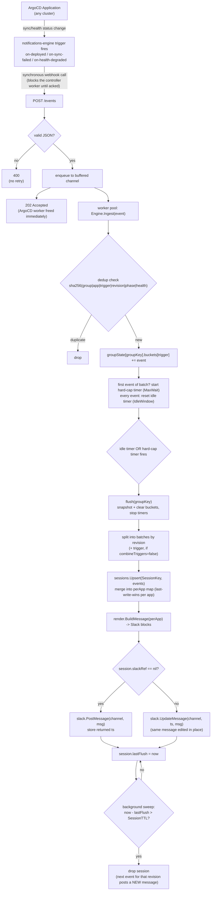

# argocd-notifier

ArgoCD notification aggregation service.

## Problem

ArgoCD's notifications-engine fires one message per `Application`. When an ApplicationSet fans a single service out across many clusters (e.g. one service targeting N clusters, all sharing a label like `application/name: sample`), a single fleet-wide deploy or incident produces one Slack message per cluster instead of one per rollout.

argocd-notifier sits between ArgoCD's notifications-engine and Slack: it receives one webhook call per Application event, groups events sharing a label, and keeps **one live Slack message per rollout**, editing it in place as more events arrive, instead of posting a new message every time.

## Design decisions

- **Grouping key is configurable** — a label name (i.e. `application/name`), not hardcoded, since this is meant to be reused by other ArgoCD users with their own label scheme.
- **Debounce, not just batching**: an idle-reset timer (extends on each new event) plus an independent hard max-wait cap that never extends. Both configurable. This paces how often Slack gets hit — it does not define how long a rollout's message stays live.
- **Sessions**: a Slack message represents one *session*, keyed by `(groupKey, revision)` by default, or `(groupKey, revision, trigger)` when `combineTriggers=false`. Every flush for an existing session calls `chat.update` on the same message timestamp instead of posting a new one; the message always reflects each app's latest known status (last-write-wins per app name), not just the most recent flush's delta. A session expires after `sessionTTL` of inactivity — a later event for the same revision then starts a fresh message rather than editing one that's scrolled out of view.
- **The aggregator posts to Slack directly** with its own bot token (`chat.postMessage` / `chat.update`) — ArgoCD talks to it via a `service.webhook.<name>` notifier, not the other way around. The existing per-app `slack.channels` config is reused verbatim: swapping the subscribe-annotation suffix from `.slack` to the aggregator's service name carries the same channel list through as `.recipient`, so there's no new per-app config surface upstream.
- **Deferred, not in v1**: fan-out-count awareness (e.g. showing "3/20 clusters" instead of "3 clusters"), and any new ArgoCD-side "in-progress" trigger. v1 works with whatever triggers already exist upstream (e.g. `on-deployed`, `on-sync-failed`, `on-health-degraded`).
- **In-memory state, single replica**: no Redis, no persistence of session→message-timestamp mappings across restarts. If the aggregator pod restarts mid-rollout, the next event for that revision can't find the prior message and posts a new one instead of editing it — accepted as a rare-case tradeoff rather than engineered around, since restarts should be infrequent and root causes (e.g. OOMs) should be fixed rather than masked by dedup machinery.
- **Scope**: single Slack backend, no plugin architecture for other chat backends, no Helm chart authoring yet — kept minimal for v1, with narrow internal interfaces (`Publisher`, storage access) left as the seams for later extension rather than building them now.

## Flow

## Status

Design phase — implementation not yet started.
