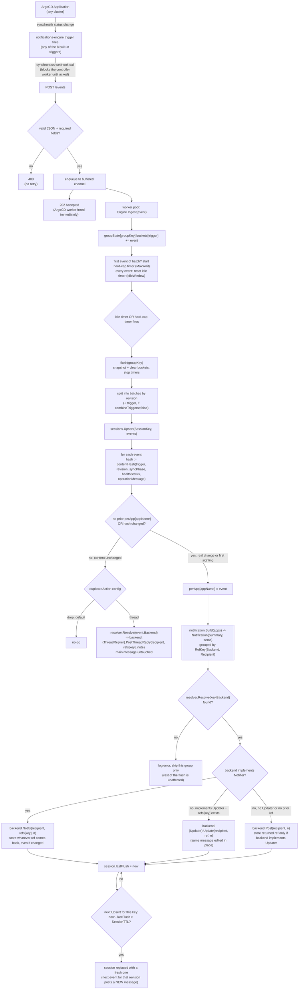

# Design

How argocd-notifier works, and why it's built the way it is.

## Problem

ArgoCD's notifications-engine fires one message per `Application`. When an ApplicationSet fans a single service out across many clusters — one service targeting N clusters, all sharing a label like `application/name: sample` — a single fleet-wide deploy or incident produces one notification per cluster instead of one per rollout. For a service deployed to, say, 18 clusters, that's 18 separate messages for what a human thinks of as one event.

argocd-notifier's core sits between ArgoCD's notifications-engine and one or more **notification backends** — separate processes, in any language, that self-register with the core and render/deliver to wherever they actually notify (Slack, email, PagerDuty, ...). The core receives one webhook call per `Application` trigger firing, groups events that share a label, and keeps **one live message per rollout**, editing it in place as more events arrive, instead of posting a new one every time — that debounce/session/dedup logic is the hard, valuable part, and it's entirely backend-agnostic.

## Components

| Package | Responsibility |
|---|---|
| `internal/event` | The wire contract with ArgoCD — the JSON shape a webhook call decodes into, and validation of the fields the rest of the system depends on. |
| `internal/receiver` | HTTP handler that decodes/validates/enqueues an event and acks fast (`202`), plus the worker pool draining the queue. |
| `internal/aggregator` | The debounce engine (`Engine`) that batches events per group, and the session store (`SessionPublisher`) that turns batches into backend posts/updates via a `BackendResolver`. |
| `internal/notification` | Backend-neutral domain model (`Notification`, `Item`) built from a session's per-app state, plus the `Backend`/`Updater`/`ThreadReplier`/`Notifier` interfaces a resolved backend value is dispatched through. |
| `internal/registry` | In-memory registration bookkeeping: a backend calls `POST /v1/backends/register` (also its heartbeat) to become routable under its declared name. |
| `internal/remotebackend` | Adapts a registry entry into something `SessionPublisher` can call — `Notify`/`PostThreadReply` over HTTP, re-checking the registry on every call. See [remote-backends.md](remote-backends.md). |
| `internal/slack` | Slack rendering/client code (Block Kit, `chat.postMessage`/`chat.update`). Not wired into the core binary — wrapped behind `internal/slackbackend`'s HTTP contract as its own process, `cmd/slack-backend` (see [remote-backends.md](remote-backends.md)'s Phase 5). |
| `internal/leader` | Leader election for safely running more than one replica (see [High Availability](#high-availability)). |
| `internal/leaderproxy` | Per-request routing once a leader is elected: handle locally if leading, otherwise reverse-proxy to whoever is (see [High Availability](#high-availability)). |
| `internal/config` | Environment-variable-driven configuration for all of the above. |
| `cmd/argocd-notifier` | Wires everything together and runs the HTTP server. |

## Why a debounce window, not just batching

An idle-reset timer (`IDLE_WINDOW`) extends every time a new event arrives in the same group; an independent hard cap (`MAX_WAIT`) never extends. Whichever fires first flushes the batch. This paces how often a backend gets hit — it does **not** define how long a rollout's message stays live (that's the session's job, below). Without the hard cap, a group that keeps receiving events in quick succession (e.g. a slow rolling deploy) could delay its first notification indefinitely; without the idle-reset, a burst of near-simultaneous events would get split across multiple debounce windows instead of batching into one.

## Sessions: why messages update in place

A destination's message represents one *session*. By default a session is keyed by `(groupKey, revision)`; with `COMBINE_TRIGGERS=false` it's keyed by `(groupKey, revision, trigger)` instead, so e.g. a deploy-success wave and a health-degraded wave for the same revision never share a message.

Every debounce flush for an existing session asks the resolved backend to edit the same message reference instead of posting a new one (exactly how depends on the backend — see "Rendering and delivery" below). The session keeps a `perApp` map of each app's *latest* known event (last-write-wins), so the message always reflects current reality — not just the delta from the most recent flush. A session expires after `SESSION_TTL` of inactivity; a later event for the same revision then starts a fresh message rather than editing one that has scrolled far out of view.

## Duplicate events: no standalone dedup cache

ArgoCD's webhook delivery is at-least-once, and the payload carries no send-id — so a network retry of the exact same underlying event is structurally indistinguishable from a genuine recurrence of identical status (e.g. the same app reporting "Degraded" twice, days apart). Two things make this tractable without a separate dedup cache:

1. **Retries landing in the same debounce window are already harmless.** They merge into the same `perApp` entry (last-write-wins, identical values) and the batch still produces exactly one render/post per flush.
2. **For anything landing in a later window**, the session compares the incoming event's content hash (`trigger|revision|syncPhase|healthStatus|operationMessage`) against the app's last recorded entry. A real change (even a same-trigger status refinement, e.g. `Error` → `Failed`) always updates the main message. Identical content is handled per the configurable `DUPLICATE_ACTION`:
   - `"drop"` (default) — no-op, matches naive dedup, zero extra backend calls.
   - `"thread"` — a short plain-text reply under the session's message (if the resolved backend currently declares `supportsThreadReply`), main message untouched.

   Since a thread reply is truthful either way (a retry and a genuine recurrence both mean "this is still/again true"), treating an ambiguous case as a real recurrence costs little — there's no need to guess correctly.

## Rendering and delivery

`notification.Build` sorts apps by name for deterministic output and builds one backend-neutral `Item` per app via a per-trigger builder — matching each of ArgoCD's built-in triggers (`on-created`, `on-deleted`, `on-deployed`, `on-health-degraded`, `on-sync-failed`, `on-sync-running`, `on-sync-status-unknown`, `on-sync-succeeded`). An event whose trigger isn't recognized is skipped from the item list but still counted in the notification's summary line. `Item` carries structured fields (`CommitURL`/`CommitSHA`, `TriggeredBy`, `Images`, a generic `Fields` list) rather than any backend's markup — turning that into an actual message is each backend's own job, done entirely outside this process (see [remote-backends.md](remote-backends.md)).

The aggregator never talks to a backend's real API directly — every backend is a separate process, self-registered against `internal/registry` and reached over HTTP via `internal/remotebackend` (`POST /notify`, `POST /thread-reply`). ArgoCD calls argocd-notifier's core through a `service.webhook.<name>` notifier (see [setup.md](setup.md) for the ArgoCD-side wiring); the core in turn calls whichever backend an event's `backend` field names. The existing per-app channel/recipient list is reused verbatim: the subscribe-annotation's recipient value carries straight through as `.recipient` in the webhook body, so there's no new per-app config surface on the ArgoCD side beyond the `application/backend` label (see [setup.md](setup.md)).

Recipient is a **per-app** routing decision (really per-trigger, since it comes from each Application's own subscribe annotations), not "who to CC on one shared message." A session's apps are grouped by their own latest event's `(backend, recipient)` pair *before* rendering, so a service that fans out to many clusters can legitimately route different subsets to different destinations — even different backends — within the same session, e.g. dev clusters' sync events to one Slack channel, prod clusters' sync events to another, and a separate backend entirely for paging on health-degraded. Each `(backend, recipient)` pair gets its own notification built from only the apps actually addressed to it, and its own independently-tracked message reference — two different backends sharing a recipient string never collide, and neither sees the other's apps, even though they all belong to the same `(groupKey, revision)` session. An app whose event names multiple recipients (semicolon-joined) still fans out to all of them with the same content.

A resolved backend either implements `notification.Notifier` (decides post-vs-update itself, returns whatever ref represents the result — the shape every remote backend uses) or the older `Backend`/`Updater`/`ThreadReplier` trio (`Post` required, `Updater`/`ThreadReplier` optional, checked via type assertion) kept for the interfaces' own sake. If an event names a backend that isn't currently resolvable — never registered, or gone stale — only that `(backend, recipient)` group fails for the current flush; it's logged and the rest of the session is unaffected. See [adding-a-backend.md](adding-a-backend.md) for how to add a backend.

## Flow

## High availability

Running more than one replica requires leader election (`LEADER_ELECTION_ENABLED=true`). Without it, a Kubernetes `Service` load-balances ArgoCD's webhook calls across replicas, each keeping independent in-memory state — which reproduces the exact "many messages instead of one" problem this service exists to solve.

This buys **failover speed and no split-brain, not state durability**: exactly one replica is ever active (`internal/leader.Elector` campaigns for a `coordination.k8s.io/v1` `Lease`). `/readyz` is intentionally *not* gated on leadership — every replica reports ready and stays a normal Service endpoint (gating it on `IsLeader` was tried and reverted: with N replicas, N-1 permanently non-Ready pods mean the Deployment's rollout can never report "available," it sits `Progressing` forever). Instead, `internal/leaderproxy.Handler` decides per-request: the leader handles it locally, a non-leader reverse-proxies it to whoever currently holds the lease, addressed via `internal/leader.PodAddressResolver` (a `Pods.Get` call against the Kubernetes API, cached until the leader changes — needs read-only RBAC on `pods`; a DNS-based approach was tried first and reverted, since a Deployment can't give each replica the unique, stable hostname per-pod DNS records need — only a StatefulSet auto-assigns that). In the short window right after a failover where no leader is known yet, a non-leader returns `503` for that one request — logged and retried by ArgoCD's webhook client like any other 5xx, not a probe/rollout concern. The new leader still starts with empty in-memory session state, same as a plain restart; making session state (and in-flight message refs) survive a leader change would need externalized state (e.g. Redis), which is deliberately out of scope. This also means a new leader starts with zero registered backends — see [remote-backends.md](remote-backends.md)'s heartbeat section for why backends must keep re-registering, not just register once. See [README.md](../README.md#high-availability) for the required RBAC.

## Debugging

`net/http/pprof` is served on its own listener (`PPROF_ADDR`, default `:6060`) when `PPROF_ENABLED=true`, registered on a dedicated mux rather than `http.DefaultServeMux` — kept deliberately separate from the main server so it's never reachable through whatever routes ArgoCD's webhook traffic or readiness checks in. See [setup.md](setup.md) for `port-forward`/`go tool pprof` usage.

## Known limitations (accepted, not accidental)

- **In-memory state, no persistence.** A pod restart mid-rollout loses the session→message mapping; the next event for that revision posts a new message instead of editing the old one. Accepted as a rare-case tradeoff — restarts should be infrequent, and root causes (e.g. OOMs) should be fixed rather than papered over with dedup machinery.
- **No fan-out-count awareness.** A message can say "3 apps degraded" but not "3 of 20" — ArgoCD's notification payload carries no information about how many other Applications share a label, so that would require a separate watch/informer against the Application CRD. Deferred.
- **`cmd/slack-backend` is the only backend that ships today.** It wraps `internal/slack`'s rendering/client code behind `internal/slackbackend`'s HTTP contract, self-registering as its own process — see [remote-backends.md](remote-backends.md)'s Phase 5. An event whose `backend` never registers (wrong name, or that backend down) simply fails that `(backend, recipient)` group every flush (logged, not fatal). Running more than one replica of `cmd/slack-backend` doesn't give real HA yet — see the Phase 5 note in [remote-backends.md](remote-backends.md).
- **No fan-out to multiple backends per event.** An event routes to exactly one backend by name; running several backends means different events go to different single destinations, not the same notification broadcast everywhere.
- **100-attachment cap is a hardcoded default in `internal/slack`, not yet configurable.** Slack doesn't publish an exact byte-size threshold to defend against separately — revisit if/when a single rollout's app count grows enough for it to matter.
