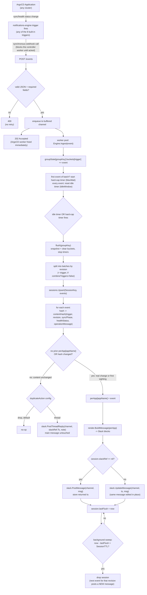

# Design

How argocd-notifier works, and why it's built the way it is.

## Problem

ArgoCD's notifications-engine fires one message per `Application`. When an ApplicationSet fans a single service out across many clusters — one service targeting N clusters, all sharing a label like `application/name: sample` — a single fleet-wide deploy or incident produces one Slack message per cluster instead of one per rollout. For a service deployed to, say, 18 clusters, that's 18 separate messages for what a human thinks of as one event.

argocd-notifier sits between ArgoCD's notifications-engine and Slack. It receives one webhook call per `Application` trigger firing, groups events that share a label, and keeps **one live Slack message per rollout**, editing that message in place as more events arrive, instead of posting a new message every time.

## Components

| Package | Responsibility |
|---|---|
| `internal/event` | The wire contract with ArgoCD — the JSON shape a webhook call decodes into, and validation of the fields the rest of the system depends on. |
| `internal/receiver` | HTTP handler that decodes/validates/enqueues an event and acks fast (`202`), plus the worker pool draining the queue. |
| `internal/aggregator` | The debounce engine (`Engine`) that batches events per group, and the session store (`SessionPublisher`) that turns batches into Slack posts/updates. |
| `internal/render` | Builds a Slack message (Block Kit attachments) from a session's current per-app state. |
| `internal/slack` | Thin Slack Web API client (`chat.postMessage` / `chat.update`) with retry/backoff. |
| `internal/leader` | Leader election for safely running more than one replica (see [High Availability](#high-availability)). |
| `internal/config` | Environment-variable-driven configuration for all of the above. |
| `cmd/argocd-notifier` | Wires everything together and runs the HTTP server. |

## Why a debounce window, not just batching

An idle-reset timer (`IDLE_WINDOW`) extends every time a new event arrives in the same group; an independent hard cap (`MAX_WAIT`) never extends. Whichever fires first flushes the batch. This paces how often Slack gets hit — it does **not** define how long a rollout's message stays live (that's the session's job, below). Without the hard cap, a group that keeps receiving events in quick succession (e.g. a slow rolling deploy) could delay its first Slack message indefinitely; without the idle-reset, a burst of near-simultaneous events would get split across multiple debounce windows instead of batching into one.

## Sessions: why messages update in place

A Slack message represents one *session*. By default a session is keyed by `(groupKey, revision)`; with `COMBINE_TRIGGERS=false` it's keyed by `(groupKey, revision, trigger)` instead, so e.g. a deploy-success wave and a health-degraded wave for the same revision never share a message.

Every debounce flush for an existing session calls `chat.update` on the same message timestamp instead of posting a new message. The session keeps a `perApp` map of each app's *latest* known event (last-write-wins), so the message always reflects current reality — not just the delta from the most recent flush. A session expires after `SESSION_TTL` of inactivity; a later event for the same revision then starts a fresh message rather than editing one that has scrolled far out of view in the channel.

## Duplicate events: no standalone dedup cache

ArgoCD's webhook delivery is at-least-once, and the payload carries no send-id — so a network retry of the exact same underlying event is structurally indistinguishable from a genuine recurrence of identical status (e.g. the same app reporting "Degraded" twice, days apart). Two things make this tractable without a separate dedup cache:

1. **Retries landing in the same debounce window are already harmless.** They merge into the same `perApp` entry (last-write-wins, identical values) and the batch still produces exactly one render/post per flush.
2. **For anything landing in a later window**, the session compares the incoming event's content hash (`trigger|revision|syncPhase|healthStatus|operationMessage`) against the app's last recorded entry. A real change (even a same-trigger status refinement, e.g. `Error` → `Failed`) always updates the main message. Identical content is handled per the configurable `DUPLICATE_ACTION`:
   - `"drop"` (default) — no-op, matches naive dedup, zero extra Slack API calls.
   - `"thread"` — a short plain-text Slack thread reply under the session's message, main message untouched.

   Since a thread reply is truthful either way (a retry and a genuine recurrence both mean "this is still/again true"), treating an ambiguous case as a real recurrence costs little — there's no need to guess correctly.

## Rendering and delivery

`render.BuildMessage` sorts apps by name for deterministic output, builds one Block Kit attachment per app via a per-trigger builder (colors/fields matching each of ArgoCD's built-in triggers — `on-created`, `on-deleted`, `on-deployed`, `on-health-degraded`, `on-sync-failed`, `on-sync-running`, `on-sync-status-unknown`, `on-sync-succeeded`), and chunks past Slack's 50-attachment limit with a "+N more" marker. An event whose trigger isn't recognized is skipped from the attachment list but still counted in the message's summary line.

The aggregator posts to Slack **directly**, with its own bot token — ArgoCD talks to argocd-notifier through a `service.webhook.<name>` notifier, not the other way around (see [setup.md](setup.md) for the ArgoCD-side wiring). The existing per-app Slack channel list is reused verbatim: the subscribe-annotation's recipient value carries straight through as `.recipient` in the webhook body, so there's no new per-app config surface on the ArgoCD side. A session's recipient can be multiple channels (semicolon-joined); each gets its own post/update, tracked by its own message timestamp.

## Flow

## High availability

Running more than one replica requires leader election (`LEADER_ELECTION_ENABLED=true`). Without it, a Kubernetes `Service` load-balances ArgoCD's webhook calls across replicas, each keeping independent in-memory state — which reproduces the exact "many messages instead of one" problem this service exists to solve.

This buys **failover speed and no split-brain, not state durability**: exactly one replica is ever active (`internal/leader.Elector` campaigns for a `coordination.k8s.io/v1` `Lease`), and only the current leader's `/readyz` reports ready, so the Service's endpoint list — and therefore all traffic — follows the leader automatically. But the new leader still starts with empty in-memory session state, same as a plain restart; making session state (and in-flight Slack message `ts` references) survive a leader change would need externalized state (e.g. Redis), which is deliberately out of scope. See [README.md](../README.md#high-availability) for the required RBAC.

## Known limitations (accepted, not accidental)

- **In-memory state, no persistence.** A pod restart mid-rollout loses the session→message mapping; the next event for that revision posts a new message instead of editing the old one. Accepted as a rare-case tradeoff — restarts should be infrequent, and root causes (e.g. OOMs) should be fixed rather than papered over with dedup machinery.
- **No fan-out-count awareness.** A message can say "3 apps degraded" but not "3 of 20" — ArgoCD's notification payload carries no information about how many other Applications share a label, so that would require a separate watch/informer against the Application CRD. Deferred.
- **Single Slack backend.** No plugin architecture for other chat systems yet, though the `Publisher`/`MessageBuilder`/`MessagePoster` interfaces are narrow enough that adding one wouldn't require reworking the engine or session store.
